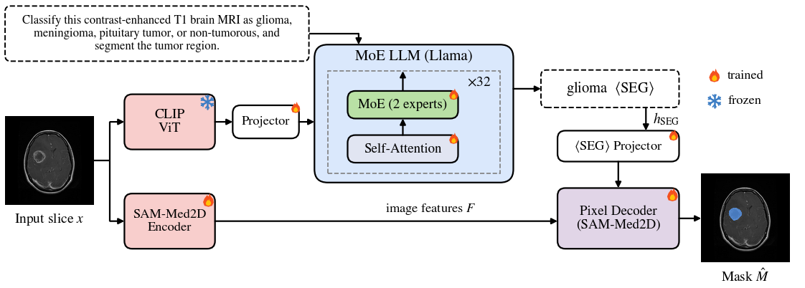
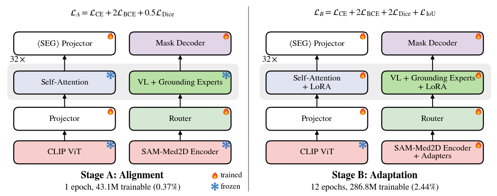
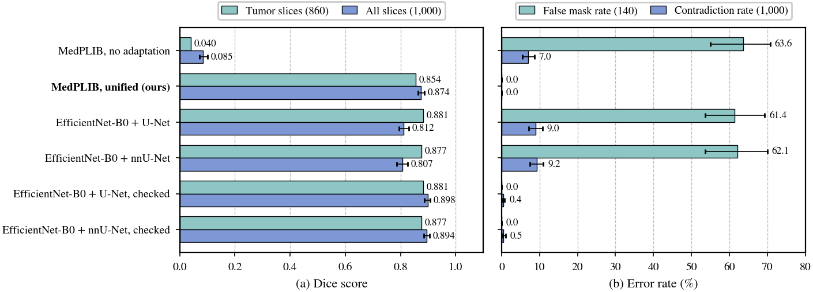
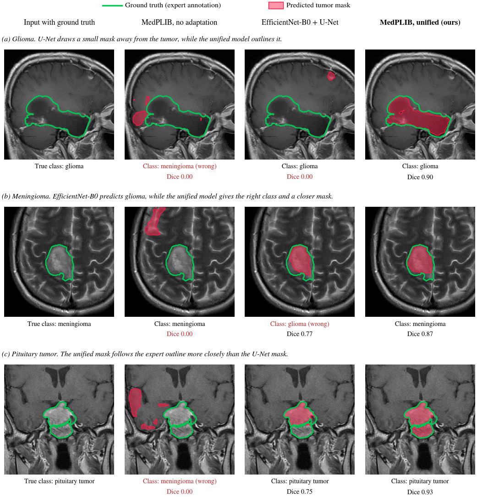
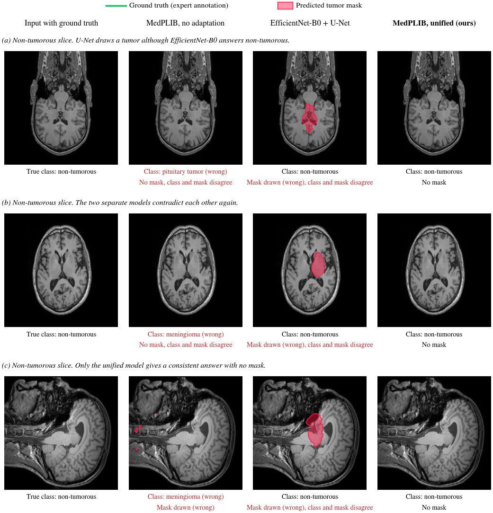

<div align="center">

# Joint Brain Tumor Classification and Segmentation from MRI<br>with an Adapted Multimodal Large Language Model

**GP8001 Group Project · Group 3 · Nanyang Technological University**

[](https://huggingface.co/spaces/Sssunset/MedPLIB-BRISC)
[](https://huggingface.co/Sssunset/MedPLIB-BRISC)




</div>

Brain tumor MRI analysis asks two questions: **which type of tumor is present**, and **where it is**. They are usually answered by two separate models, a classifier and a segmentation network, whose answers can contradict each other. We adapt **MedPLIB-7b-2e**, a biomedical multimodal large language model (MLLM), so that **one model answers both questions in one response**: given an MRI slice and an instruction, it replies `glioma <SEG>`, and the hidden state of the `<SEG>` token is decoded into the tumor mask.

## Highlights

- **One model, one answer.** The class and the mask come from the same response, so they agree by design.
- **No false alarms without extra rules.** On the 1,000 BRISC test slices, the unified model draws **no mask on any of the 140 non-tumorous slices** and its class and mask **never contradict each other**. Separate models need a hand-written rule to get there.
- **Joint training improves the mask.** Trained on both tasks instead of segmentation alone, the false mask rate drops from **27.9% to 0%** and tumor Dice rises.
- **Parameter-efficient.** Only **2.44%** of the 11.7B parameters are trained (LoRA and a few small modules).
- **Strong results.** **0.980** accuracy, **0.982** macro-F1, **0.854** Dice on tumor slices, and **0.874** Dice over all slices.

## Method

**Unified model.** A CLIP vision encoder and an image projector turn the slice into tokens for a Llama language model with two expert branches (vision-language and grounding) and a router. The model answers `c <SEG>`, where `c` is one of four classes (glioma, meningioma, pituitary tumor, non-tumorous). The hidden state at `<SEG>` is projected to a prompt vector $e$ and passed, together with the SAM-Med2D image features $F$, to the SAM-Med2D mask decoder:

$$S = \sigma\big(D(F, e)\big), \qquad \hat{M}_{ij} = \mathbb{I}\big[S_{ij} > 0.5\big].$$

**Inference by answer scoring.** Instead of parsing free text, we score each of the four valid answers by its log-likelihood and keep the best one. The mask comes from the `<SEG>` state of the winning answer. No rule removes the mask for a non-tumorous answer, so an empty mask has to come from the model itself.

$$\hat{y} = \arg\max_{c \in \mathcal{C}} \sum_{t=1}^{T_c} \log p_\theta\big(a^{(c)}_t \mid a^{(c)}_{<t}, x, q\big)$$

**Two-stage adaptation.**

<p align="center"></p>

| Stage | Epochs | What is trained | Trainable parameters | Loss |
|---|---|---|---|---|
| A: Alignment | 1 | image projector, router, `<SEG>` projector, mask decoder | 43.1M (0.37%) | CE + 2 BCE + 0.5 Dice |
| B: Adaptation | 12 | Stage A modules, LoRA (r = 16, α = 32) on attention and both experts in all 32 layers, SAM-Med2D encoder adapters | 286.8M (2.44%) | CE + 2 BCE + 2 Dice + IoU |

Training prompts are mixed: 50% ask for the class and the mask, 25% for the class only, and 25% for the mask only. Non-tumorous slices are trained with an empty mask. We use AdamW (LoRA lr 2e-5, new modules 1e-4), bf16, DeepSpeed ZeRO-2, and an effective batch size of 64 on 8 NVIDIA A100 GPUs.

## Results

All models are trained on the official BRISC 2025 split (5,000 training and 1,000 test slices, of which 860 contain a tumor and 140 do not) and scored by the same evaluation script. The unified model results come from one training run (seed 42).

| Model | Accuracy | Macro-F1 | Tumor Dice | Dice (all slices) | False mask rate | Contradictions | Both answers correct |
|---|---|---|---|---|---|---|---|
| MedPLIB, no adaptation | 0.294 | 0.123 | 0.040 | 0.085 | 63.6% | 7.0% | 1.2% |
| **MedPLIB, unified (ours)** | **0.980** | **0.982** | **0.854** | **0.874** | **0.0%** | **0.0%** | **93.9%** |
| EfficientNet-B0 | 0.993 | 0.994 | – | – | – | – | – |
| U-Net (ResNet-34) | – | – | 0.881 | 0.812 | 61.4% | – | – |
| nnU-Net 2D | – | – | 0.877 | 0.807 | 62.1% | – | – |
| EfficientNet-B0 + U-Net | 0.993 | 0.994 | 0.881 | 0.812 | 61.4% | 9.0% | 87.0% |
| EfficientNet-B0 + U-Net, checked | 0.993 | 0.994 | 0.881 | 0.898 | 0.0% | 0.4% | 95.6% |
| EfficientNet-B0 + nnU-Net, checked | 0.993 | 0.994 | 0.877 | 0.894 | 0.0% | 0.5% | 95.3% |

*Tumor Dice* is computed on the 860 tumor slices. *Dice (all slices)* also counts the 140 non-tumorous slices, where an empty mask scores 1 and any mask scores 0. *False mask rate* is the share of non-tumorous slices that receive a mask. *Contradictions* counts slices where the class and the mask disagree about whether a tumor is present. *Both answers correct* means the right class and a mask with Dice ≥ 0.5 (or an empty mask on a non-tumorous slice). *Checked* means a hand-written rule keeps the segmentation mask only if EfficientNet-B0 predicts a tumor.

<p align="center"></p>

**Joint training teaches the mask when to stay empty.** With the same model and the same shorter training setting (6 epochs of Stage B with the Stage A loss, seed 42), changing only the training task:

| Training task | Accuracy | Tumor Dice | Dice (all slices) | False mask rate |
|---|---|---|---|---|
| Classification only | 0.968 | – | – | – |
| Segmentation only | – | 0.737 | 0.735 | 27.9% |
| **Both tasks (unified)** | 0.964 | **0.751** | **0.786** | **0.0%** |

**Where the model is still weakest.** Tumor Dice of the unified model is 0.763 on gliomas, 0.919 on meningiomas, and 0.865 on pituitary tumors, and 0.728 / 0.859 / 0.892 on small / medium / large lesions. All 20 of its classification errors are confusions between tumor types, never between tumor and no tumor. With the hand-written rule, the EfficientNet-B0 + U-Net pipeline still reaches a slightly higher Dice over all slices, mainly because U-Net outlines tumors more precisely. Closing this gap is our next step.

**It is still a language model.** In a small check on 7 test slices, the adapted model correctly answered a question it was never trained on (whether a tumor is present). Its free-form descriptions, however, became very short after adaptation.

### Case comparisons

Green outline: expert annotation. Red area: predicted mask. These cases were selected to show where the unified model helps.

<p align="center"></p>

<p align="center"></p>

On non-tumorous slices, EfficientNet-B0 correctly answers *non-tumorous*, but U-Net, trained only on tumor slices, still draws a tumor. Over the test set, the two separate models contradict each other on 86 of the 140 non-tumorous slices, and the unified model on none.

## Repository layout

```
configs/
  paths.yaml                 server paths (models, data, outputs)
  model/                     medplib_7b_2e.yaml + baselines (efficientnet_b0, unet_resnet34, sam_med2d_box)
  dataset/brisc2025.yaml     classes/answers, prompts, task mix, augmentation
  train/                     stage_a.yaml, stage_b.yaml, baseline_*.yaml, control_*.yaml, overfit64.yaml
  infer/                     default.yaml (threshold, bootstrap), sam_med2d_box.yaml
medplib_bt/
  registry.py, config.py     MODELS / DATASETS registries, YAML configs with --set overrides
  models/medplib.py          "medplib_moe": load checkpoint, LoRA, trainable modules, adapters
  models/baselines/          "timm_classifier", "smp_unet", "sam_med2d_prompt"
  datasets/brisc.py          "brisc2025": training / inference datasets
  datasets/manifest.py       build data/manifest.csv from the BRISC folders
  engine/inference.py        log-likelihood classification + <SEG> mask decoding, metrics
  train.py, infer.py, evaluate.py        MedPLIB training, inference, metrics
  train_baseline.py, infer_baseline.py   baselines, same prediction layout as infer.py
  aggregate.py, consistency.py           result tables, class/mask decision consistency
  describe.py, demo_app.py               free-text generation, interactive demo
scripts/                     setup_env.sh, download_data.sh, download_models.sh, run_*.sh
third_party/MedPLIB/         vendored upstream code (unmodified, media stripped)
```

## Getting started

**Setup**

```bash
scripts/setup_env.sh                       # conda env `medplib` (torch 2.1.2, transformers 4.31, deepspeed 0.13.1, peft 0.10)
scripts/download_data.sh                   # BRISC 2025 from Kaggle -> data/brisc2025
scripts/download_models.sh                 # MedPLIB-7b-2e, CLIP-L/336, SAM-Med2D-B
python scripts/make_safetensors_index.py   # index for the safetensors shards
python -m medplib_bt.datasets.manifest     # data/manifest.csv
```

**Use our trained weights**

The trained weights are on [Hugging Face](https://huggingface.co/Sssunset/MedPLIB-BRISC). After the setup above, they can be used directly without training:

```bash
huggingface-cli download Sssunset/MedPLIB-BRISC --local-dir checkpoints/medplib-brisc
scripts/run_infer.sh 0,1,2,3 outputs/preds/medplib-brisc --adapter checkpoints/medplib-brisc   # test set + metrics
python -m medplib_bt.demo_app --adapter checkpoints/medplib-brisc --port 7860                  # interactive demo
```

**Train and evaluate**

```bash
scripts/run_train.sh 0,1,2,3,4,5,6,7 configs/train/stage_a.yaml stageA_seed42
scripts/run_train.sh 0,1,2,3,4,5,6,7 configs/train/stage_b.yaml stageB_seed42 --init-from outputs/runs/stageA_seed42/final
scripts/run_infer.sh 0,1,2,3 outputs/preds/stageB_seed42 --adapter outputs/runs/stageB_seed42/final   # test set + metrics
scripts/run_infer.sh 0,1,2,3 outputs/preds/zeroshot --no-adapter                                     # model without adaptation
scripts/run_pipeline.sh 0,1,2,3,4,5,6,7 42                                                            # stage A -> B -> test, one seed
```

**Baselines** (one GPU each, scored by the same `evaluate.py`)

```bash
scripts/run_baseline.sh 0 configs/train/baseline_efficientnet.yaml effnet_b0_seed42
scripts/run_baseline.sh 1 configs/train/baseline_unet.yaml unet_r34_seed42
scripts/run_nnunet.sh 2 nnunet_2d
```

**Result tables and demo**

```bash
python -m medplib_bt.aggregate --seeds outputs/preds/stageB_seed42 --zeroshot outputs/preds/zeroshot \
    --baseline "EfficientNet-B0=outputs/preds/effnet_b0_seed42" --baseline "U-Net R34=outputs/preds/unet_r34_seed42" \
    --baseline "nnU-Net 2D=outputs/preds/nnunet_2d" --out outputs/results
python -m medplib_bt.consistency --model "MedPLIB=outputs/preds/stageB_seed42" \
    --pipeline "EfficientNet-B0 + U-Net=outputs/preds/effnet_b0_seed42,outputs/preds/unet_r34_seed42" \
    --gated "EfficientNet-B0 gate + U-Net=outputs/preds/effnet_b0_seed42,outputs/preds/unet_r34_seed42" --out outputs/results
python -m medplib_bt.demo_app --adapter outputs/runs/stageB_seed42/final --port 7860
```

Any config value can be overridden on the command line, e.g. `--set seed=123 --set model.lora.r=8`. Results land in `outputs/preds/<run>/eval/`.

## Team

GP8001 Group 3, Nanyang Technological University

| Member | School |
|---|---|
| Simon Tong Sing Hee | Asian School of the Environment (ASE) |
| Zeng Yi | College of Computing and Data Science (CCDS) |
| Feng Peilin | School of Electrical and Electronic Engineering (EEE) |
| Ye Xiaomeng | Lee Kong Chian School of Medicine (LKCMedicine) |
| Lyu Muyang | School of Mechanical and Aerospace Engineering (MAE) |
| Timothy Aw Bang Hao | School of Social Sciences (SSS) |

## Acknowledgements

This project builds on [MedPLIB](https://arxiv.org/abs/2412.09278) and its [MedPLIB-7b-2e weights](https://huggingface.co/Huangxs/MedPLIB-7b-2e), [SAM-Med2D](https://arxiv.org/abs/2308.16184), [LISA](https://arxiv.org/abs/2308.00692), and [nnU-Net](https://github.com/MIC-DKFZ/nnUNet). We use the [BRISC 2025 dataset](https://www.nature.com/articles/s41597-026-06753-y) (Fateh et al., *Scientific Data*, 2026). We thank the authors for releasing their code, models, and data.

## Disclaimer

This is a course research prototype trained and tested on a public dataset. It is not a medical device and must not be used for clinical diagnosis or treatment decisions.
